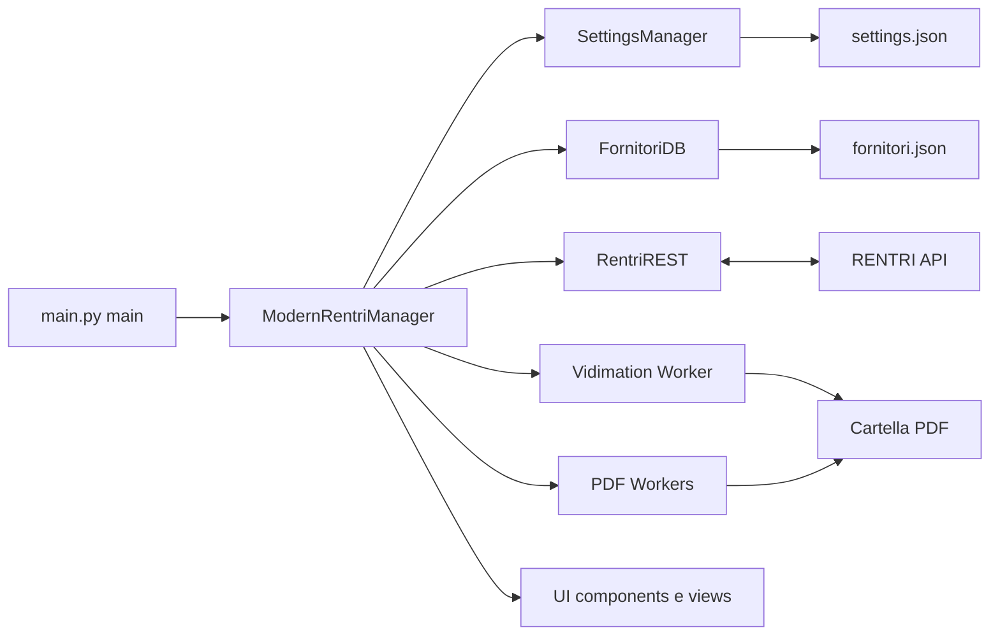
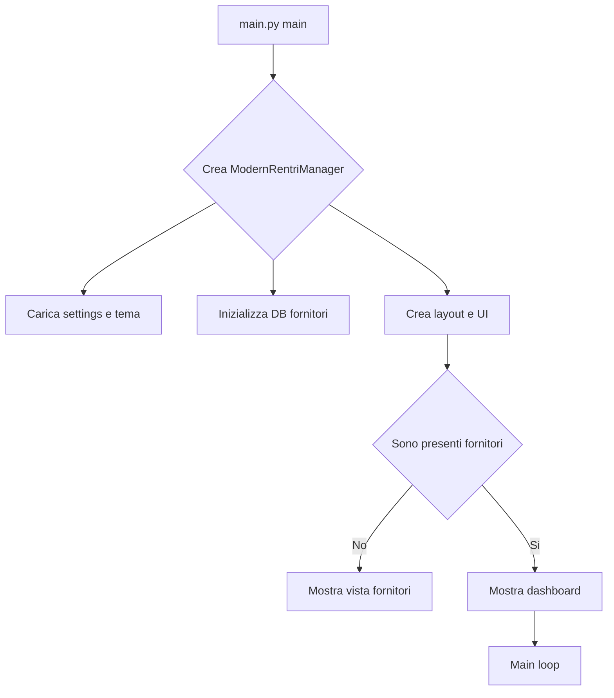
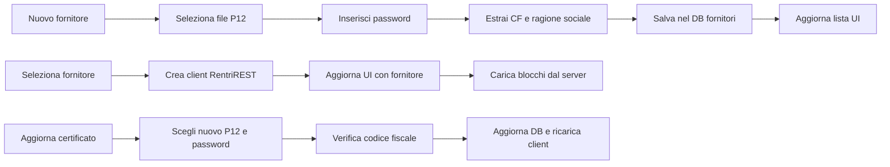
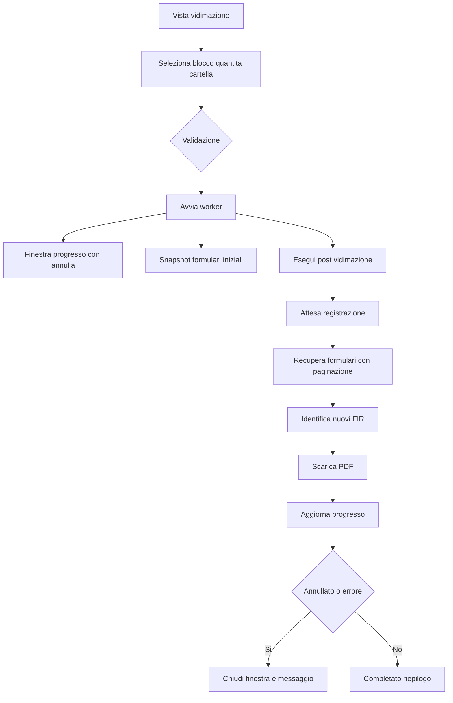
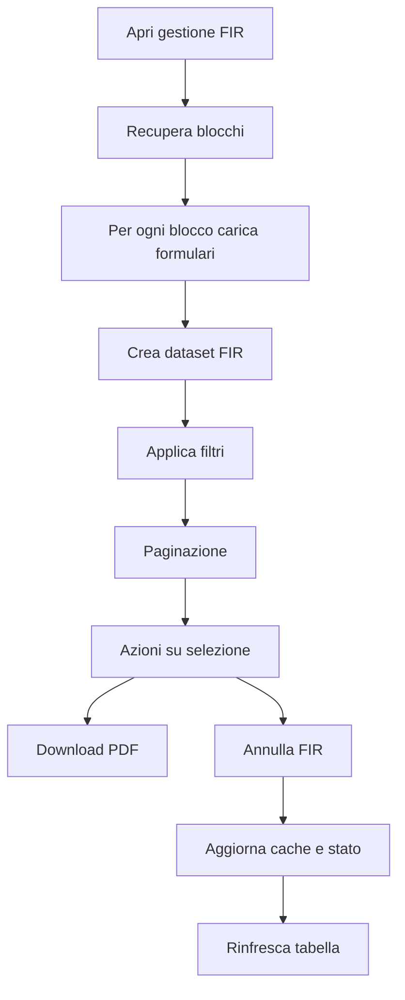
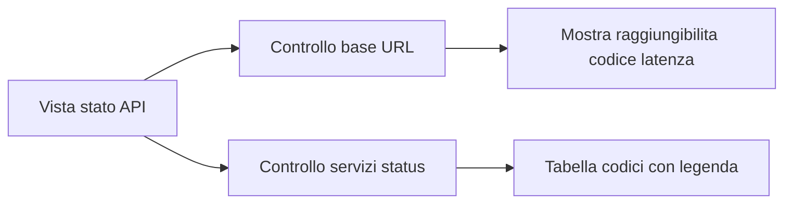
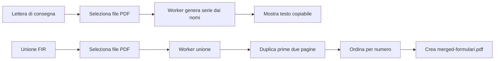

# RENTRI Manager - Complete Edition (v2.0)

Applicazione desktop per la gestione RENTRI: fornitori con certificato P12, vidimazione FIR, gestione e annullamento FIR, strumenti PDF e verifica stato API. Interfaccia moderna con CustomTkinter e operazioni lunghe in background con finestra di progresso e annulla.

## Indice
- Requisiti
- Avvio rapido
- Struttura del progetto
- Architettura (Mermaid)
- Funzionalita principali
- Dettagli tecnici
- Configurazione e file dati
- Risoluzione problemi
- Sviluppo e build
- Screenshot
- Crediti

## Requisiti

- Python 3.8 o superiore
- Windows, macOS o Linux
- Dipendenze (vedi `requirements.txt`): customtkinter, requests, PyJWT, cryptography, PyPDF2, Pillow

Installazione dipendenze:
```bash
pip install -r requirements.txt
```

## Avvio rapido

```bash
python main.py
```

Primi passi:
- Apri la sezione Fornitori e aggiungi un certificato P12 con password.
- Seleziona il fornitore per attivare Blocchi, Vidimazione, Gestione FIR e Stato API.

## Struttura del progetto

```
.
- main.py                         # Entry point
- api/
  - rentri_client.py              # Client REST RENTRI con JWT e rate limiting
- config/
  - constants.py                  # Costanti app, colori, endpoint, rate limit
- models/
  - fornitori_db.py               # Persistenza fornitori (fornitori.json)
  - settings_manager.py           # Gestione impostazioni (settings.json)
- ui/
  - main_window.py                # Finestra principale e navigazione
  - components/
    - cards.py                    # DashboardCard, CertificateCard, ClickableLabel
    - progress_window.py          # Finestra di progresso con annulla
  - views/
    - api_status_view.py          # Vista stato API
    - fir_view.py                 # Ricerca, paginazione, download e annullamento FIR
    - pdf_views.py                # Lettera di consegna e unione PDF
- utils/
  - certificate.py                # Utilita P12: CF, ragione sociale, date, scadenza
  - logger.py                     # Debug logging
- workers/
  - pdf_workers.py                # Worker PDF
  - vidimation_worker.py          # Worker vidimazione con annulla
- requirements.txt
- settings.json                   # Impostazioni utente (creato dall'app)
- fornitori.json                  # DB fornitori (creato dall'app)
```

## Architettura (Mermaid)

Panoramica componenti:


Flusso di avvio:


Fornitori (aggiunta, selezione, aggiornamento):


Vidimazione FIR:


Gestione FIR: ricerca, paginazione, download, annullamento


Stato API:


Strumenti PDF:


## Funzionalita principali

- Gestione fornitori multipli con certificato P12 e ricerca
- Vidimazione automatizzata con progressi e annulla
- Gestione FIR con paginazione, filtri, download e annullamento
- Dashboard con statistiche e stato certificato
- Strumenti PDF per lettere di consegna e unione
- Verifica raggiungibilita di BASE URL e stato servizi status
- Tema scuro o chiaro e logo personalizzabile

## Dettagli tecnici

- Autenticazione: JWT firmati con chiave privata dal P12 (RS256 o ES256)
- Rate limiting: finestra 5s, gestione 429 con backoff
- Download PDF: payload JSON con contenuto base64, nome file normalizzato
- Annullamento FIR: chiamata PUT con intestazioni firmate

## Configurazione e file dati

- `settings.json`: tema, logo, flag vari (gestito da SettingsManager)
- `fornitori.json`: path certificato e password (gestito da FornitoriDB)
- `config/constants.py`: BASE URL, AUDIENCE, colori, rate limit, timeout

Sicurezza certificato:
- Il percorso del P12 e la password sono salvati localmente in `fornitori.json`. Proteggi macchina e cartella progetto.
- Usa credenziali con i soli permessi necessari.

## Risoluzione problemi

- Certificato P12: verifica password e che il CF sia presente nel certificato
- Nessun blocco o FIR: verifica fornitore selezionato e connettivita (sezione Stato API)
- 429 Too Many Requests: attendi alcuni secondi (c'e backoff nel client)
- PDF assente o vuoto: controlla presenza campo base64 e permessi di scrittura

## Sviluppo e build

Esecuzione in sviluppo:
```bash
pip install -r requirements.txt
python main.py
```

Packaging (PyInstaller):
- Presente `RENTRI_Manager.spec` per creare un eseguibile standalone Windows

## Screenshot

Sostituisci i segnaposto con immagini reali in `docs/screenshots/`.

- Dashboard

  

- Fornitori

  

- Vidimazione FIR

  

- Gestione FIR

  

- Stato API

  

- Strumenti PDF

  

## Crediti

Creato da Giovanni Pio Familiari - Versione 2.0 (Refactored)

